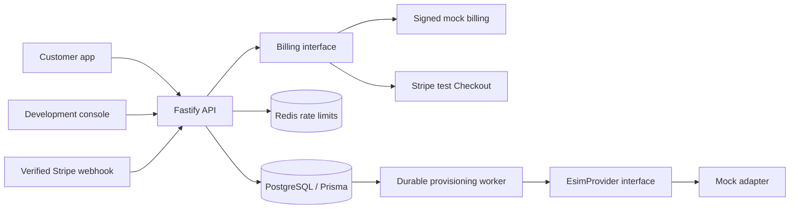

# Architecture

## Foundation and boundaries

This is a development foundation implementing Phases 1–4. Expo/React Native is the customer app; React/Vite is a read-only admin shell. Both consume a typed API client. Shared Zod schemas validate auth, device, checkout and installation input. Shared dictionaries cover English, Haitian Creole and French; product copy deliberately identifies simulation. Translation review by native speakers is recommended before release.

The database is authoritative. Redis is for distributed request limiting, not payment truth. A PostgreSQL provisioning job acts as a transactional outbox: payment success, eSIM creation and job insertion commit together. Workers use `FOR UPDATE SKIP LOCKED`, leases and unique constraints to support multiple workers and crash recovery. Adapter calls use a stable subscription ID as their idempotency key.

## Data model

- User → Session: hashed passwords, short-lived access tokens, hashed rotating refresh tokens and replay-detection families.
- User → Device: self-reported eSIM support and unlocked status. Ownership is rechecked at checkout.
- Plan → Subscription: development plan catalog and customer entitlement lifecycle.
- Subscription → Payment: immutable server-side amount/currency snapshot, checkout request key and provider session reference.
- Payment → WebhookEvent: unique event IDs, verified transitions and durable deduplication.
- Subscription → Esim → ProvisioningJob: one eSIM and one durable job per purchase.
- Esim → Usage: timestamped byte measurements, allowance, simulation flag.
- Provider → ProviderProduct → PlanProviderMapping: internal plan-to-provider product selection; provider product identifiers remain server-side.
- Provider → ProviderOperation: operation history with idempotency, safe error code, attempts and explicit lifecycle state.
- Provider → ProviderWebhookEvent: deduplicated verified provider events.
- RenewalPayment and ReconciliationIssue: renewal receipts and non-destructive review flags.

Unique keys and transactions enforce these relationships. PostgreSQL stores byte counters as BIGINT; API DTOs use safe JS numbers within the current 50 GB maximum.

## HTTP surface

All customer routes require bearer authentication unless marked public. Responses containing customer data use `Cache-Control: no-store`.

| Route | Methods and purpose |
| --- | --- |
| `/health`, `/health/ready` | GET public liveness; database/Redis readiness |
| `/api/v1/auth/register`, `/login`, `/refresh` | POST public, strict rate limits; paths share the `/api/v1/auth` prefix |
| `/api/v1/auth/logout` | POST revoke session family |
| `/api/v1/me` | GET current account |
| `/api/v1/devices` | GET own devices; POST compatibility answers |
| `/api/v1/plans` | GET public enabled development plans |
| `/api/v1/checkout` | POST create/reuse checkout; UUID `Idempotency-Key` required |
| `/api/v1/checkout/:paymentId/simulate` | POST owner-only signed payment simulation, mock mode only |
| `/api/v1/subscriptions` | GET own subscriptions, payment and safe eSIM summaries |
| `/api/v1/subscriptions/:id/renew` | POST start an owner-scoped renewal checkout when persistent top-up capability is present |
| `/api/v1/esims` | GET own safe eSIM summaries |
| `/api/v1/esims/capabilities` | GET current adapter capability flags |
| `/api/v1/esims/:id/installation` | GET decrypted owner setup data; POST guarded mock practice action |
| `/api/v1/esims/:id/retry` | POST requeue an exhausted, paid provisioning job |
| `/api/v1/usage?esimId=...` | GET own usage; optional owner-scoped filter |
| `/api/v1/webhooks/stripe` | POST signature-authenticated raw JSON webhook |
| `/api/v1/webhooks/esim/:provider` | POST raw provider event through an injected signature verifier; event IDs are deduplicated |
| `/api/v1/admin/provider-operations/*` | Development-only read views and manual reconciliation scan; no blind retries |

Lists have a 100-record cap; pagination and support tooling are deferred. Client responses omit password hashes, session hashes, provider references and encrypted database fields.

## Lifecycle semantics

Payment `PENDING → SUCCEEDED` queues provisioning. `PENDING → FAILED` makes the subscription `PAST_DUE` and provisions nothing. A verified late success can recover failure. A late failure never reverses success. Subscription stays `PENDING` during setup and becomes `ACTIVE` only after the adapter confirms activation. In mock mode, this means simulated state only.

Subscriptions have `PENDING`, `ACTIVE`, `PAST_DUE`, `SUSPENDED`, `CANCELING`, `CANCELED`, `EXPIRED`. The worker expires active subscriptions after their duration. Renewal package assignment checks persistent-profile and top-up capabilities, records an operation before calling the provider, and extends the period only after confirmed package assignment. Suspension, cancelation, refund and dispute customer workflows remain deferred.

eSIM states: `CREATED`, `READY`, `INSTALLED`, `ACTIVE`, `SUSPENDED`, `EXPIRED`, `TERMINATED`, `ERROR`. Installation states: `NOT_CREATED`, `PROVISIONING`, `READY_TO_INSTALL`, `INSTALLING`, `INSTALLED`, `ACTIVATING`, `ACTIVE`, `FAILED`. Client practice steps are guarded and idempotent; skip-ahead transitions fail. `ACTIVATING` is transient within the activation transaction. Future asynchronous adapters need callback-based progression and reconciliation.

## Deliberate limits

No real data connectivity, phone service, number assignment, coverage promise, provider auto-renewal, refunds, production-grade admin privilege management, email delivery, password reset or production deployment exists here. Production is blocked even when an unknown provider name is supplied. Adding a real adapter requires implementing its contract and reviewing production readiness; changing an environment variable alone cannot enable production.
